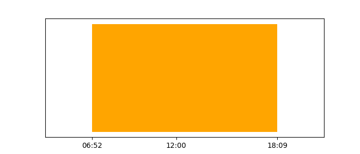

Boston Weather, last updated 02:16.

# ☁️ Overcast clouds, 60.3ºF

Feels like 60.2ºF

|  | Temperature |
| -- | -- |
| High | 62.7ºF |
| Low | 56.9ºF |

## Sun

Around 13 hours of sunlight. Sunrise 4 hours from now and sunset 15 hours from now.



## Build setup

Install [pyenv](https://github.com/pyenv/pyenv), then clone or fork the repository. Run


```shell
pyenv virtualenv 3.9.5 weather-boston-venv-venv

pyenv activate
pip install -r requirements.txt
```

To generate the README, run

```shell
python -m weather_boston
```
